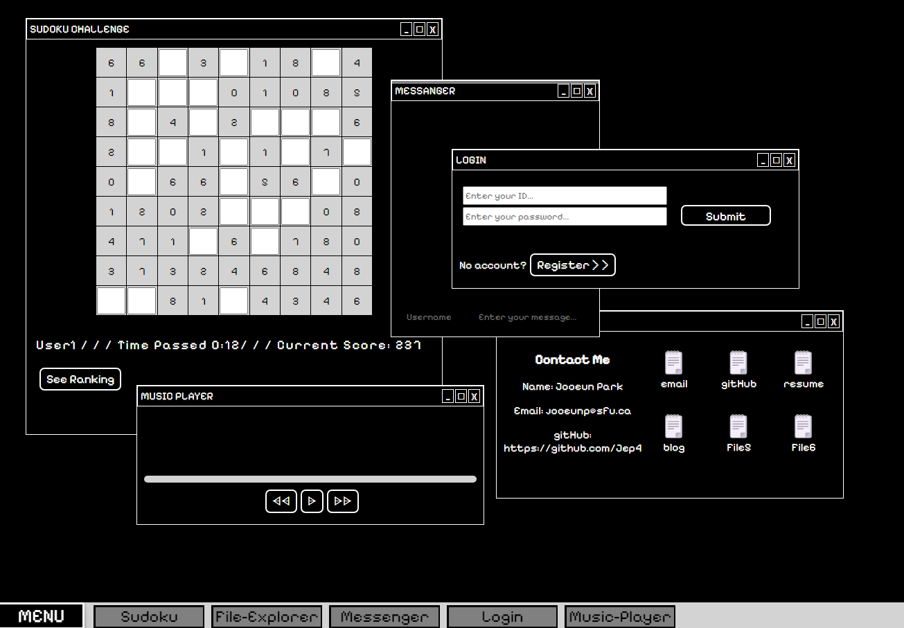

## RETRO-WiNDOW BLOG
Created with React, Typescript, Node.js express
can run in local server by: 
```
npm install
npm run start
```



## TODO LIST (Jan14 2024)

### New features / items
- [ ] Create nav bar
    - [ ] Clock <6>
    - [ ] Current windows
    - [ ] All aplications 
- [ ] Create simple online compiler<9>
- [ ] Create login feature <7>
- [ ] Create Music player <8>

### Improve 
- [ ] Add interaction in game window
    - [ ] Sudoku <5>
    - [ ] Highest score
- [ ] Main window
    - [ ] Contact me, personal info <4>
-  [ ] Chat
    - [ ] Delete feature for admin / author <3>
    - [ ] Group messages by date / sort by time 
- [ ] File Explorer 
    - [ ] Link to other websites
- [ ] Window
    - [ ] Users can change the size <10>
    - [ ] implement minimize, maximize, close feature

## Data
- [x] SQL Query -> Sequelize <1>
- [ ] Autheticate / Security <2>